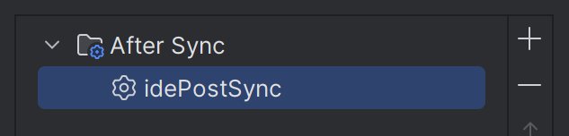

# Gradle Plugin for Developing Minecraft Mods on NeoForge


Check the NeoForged Project Listing for [latest releases](https://projects.neoforged.net/neoforged/ModDevGradle).

If you are updating to a new major version of the plugin, refer to the [list of breaking changes](BREAKING_CHANGES.md).

## Features

- Uses the latest Gradle best practices and is compatible with Gradle 8.8
- Creates the necessary artifacts to compile Minecraft mods for [NeoForge](https://neoforged.net/)
- Runs the game from Gradle or IntelliJ for debugging and testing
- Automatically creates and uses a development-friendly logging configuration for the testing the mod
- Supports the [Gradle configuration cache](https://docs.gradle.org/current/userguide/configuration_cache.html) to speed
  up repeated runs of Gradle tasks

## Basic Usage for NeoForge Mods

In `gradle.properties`:

```properties
# Enable Gradle configuration cache if you'd like:
org.gradle.configuration-cache=true
```

In `settings.gradle`:

```groovy
plugins {
    // This plugin allows Gradle to automatically download arbitrary versions of Java for you
    id 'org.gradle.toolchains.foojay-resolver-convention' version '0.8.0'
}
```

In `build.gradle`:

```groovy
plugins {
    // Apply the plugin. You can find the latest version at https://projects.neoforged.net/neoforged/ModDevGradle
    id 'net.neoforged.moddev' version '1.0.11'
}

neoForge {
    // We currently only support NeoForge versions later than 21.0.x
    // See https://projects.neoforged.net/neoforged/neoforge for the latest updates
    version = "21.0.103-beta"
    
    // Validate AT files and raise errors when they have invalid targets
    // This option is false by default, but turning it on is recommended
    validateAccessTransformers = true

    runs {
        client {
            client()
        }
        data {
            data()
        }
        server {
            server()
        }
    }

    mods {
        testproject {
            sourceSet sourceSets.main
        }
    }
}
```

See the example code in [the test project](./testproject/build.gradle).

## Vanilla-Mode

In multi-loader projects, you'll often need a subproject for your cross-loader code. This project will also need
access to Minecraft classes, but without any loader-specific extensions.

This plugin solves that by offering a "Vanilla-mode" which you enable by
specifying a [NeoForm version](https://projects.neoforged.net/neoforged/neoform) instead of a NeoForge version.
NeoForm contains the necessary configuration to produce Minecraft jar-files that you can compile against
that contain no other modifications.

In Vanilla-mode, only the `client`, `server` and `data` run types are supported.
Since the plugin includes no mod loader code in this mode, only basic resource- and data packs will be usable in-game.

In `build.gradle`:

Apply the plugin as usual and use a configuration block like this:

```groovy
neoForge {
    // Look for versions on https://projects.neoforged.net/neoforged/neoform
    neoFormVersion = "1.21-20240613.152323"

    runs {
        client {
            client()
        }
        server {
            server()
        }
        data {
            data()
        }
    }
}
```

## Common Issues

### Clicking "Attach Sources" does nothing when viewing a Minecraft class (IntelliJ IDEA)
Sometimes IntelliJ gets into a state where clicking "Attach Sources" while viewing a decompiled Minecraft class 
will not work.

Reloading the Gradle Project and then clicking "Attach Sources" again will usually fix this problem.

### Task `idePostSync` not found (IntelliJ IDEA)
This error typically happens when switching to ModDevGradle from another plugin with an `idePostSync` task.
This can be fixed by unregistering the task in IntelliJ IDEA, as follows:

<details>
<summary>Click to expand</summary>

1. Open the Gradle tool window on the right, and right-click the Gradle project.


2. Click on `Tasks Activation`.


3. Select the `idePostSync` task and delete it using the `-` button.



4. Sync the Gradle project again.

</details>

## More Configuration

### Runs

Any number of runs can be added in the `neoForge { runs { ... } }` block.

Every run must have a type. Currently, the supported types are `client`, `data`, `gameTestServer`, `server`.
The run type can be set as follows:

```groovy
neoForge {
    runs {
        <run name> {
            // This is the standard syntax:
            type = "gameTestServer"
            // Client, data and server runs can use a shorthand instead:
            // client()
            // data()
            // server()
        
            // Changes the working directory used for this run.
            // The default is the 'run' subdirectory of your project
            gameDirectory = project.file('runs/client')

            // Add arguments passed to the main method
            programArguments = ["--arg"]
            programArgument("--arg")

            // Add arguments passed to the JVM
            jvmArguments = ["-XX:+AllowEnhancedClassRedefinition"]
            jvmArgument("-XX:+AllowEnhancedClassRedefinition")

            // Add system properties
            systemProperties = [
                    "a.b.c": "xyz"
            ]
            systemProperty("a.b.c", "xyz")

            // Set or add environment variables
            environment = [
                    "FOO_BAR": "123"
            ]
            environment("FOO_BAR", "123")

            // Optionally set the log-level used by the game
            logLevel = org.slf4j.event.Level.DEBUG

            // You can change the name used for this run in your IDE
            ideName = "Run Game Tests"
            
            // You can disable a run configuration being generated for your IDE
            disableIdeRun()
            // ... alternatively you can set ideName = ""

            // Changes the source set whose runtime classpath is used for this run. This defaults to "main"
            // Eclipse does not support having multiple runtime classpaths per project (except for unit tests).
            sourceSet = sourceSets.main

            // Changes which local mods are loaded in this run.
            // This defaults to all mods declared in this project (inside of mods { ... } ).
            loadedMods = [mods.<mod name 1>, mods.<mod name 2>]

            // Allows advanced users to run additional Gradle tasks before each launch of this run
            // Please note that using this feature will significantly slow down launching the game
            taskBefore tasks.named("generateSomeCodeTask")
        }
    }
}
```

Please have a look at [RunModel.java](src/main/java/net/neoforged/moddevgradle/dsl/RunModel.java) for the list of
supported properties.
Here is an example that sets a system property to change the log level to debug:

```groovy
neoForge {
    runs {
        configureEach {
            systemProperty 'forge.logging.console.level', 'debug'
        }
    }
}
```

### Jar-in-Jar

To embed external Jar-files into your mod file, you can use the `jarJar` configuration added by the plugin.

#### External Dependencies

When you want to bundle external dependencies, Jar-in-Jar has to be able to select a single copy of that dependency
when it is bundled by multiple mods (possibly even in different versions). To support this scenario, you should set
a supported version range to avoid mod incompatibilities.

```groovy
dependencies {
    jarJar(implementation("org.commonmark:commonmark")) {
        version {
            // The version range your mod is actually compatible with. 
            // Note that you may receive a *lower* version than your preferred if another
            // Mod is only compatible up to 1.7.24, for example, your mod might get 1.7.24 at runtime.
            strictly '[0.1, 1.0)'
            prefer '0.21.0' // The version actually used in your dev workspace
        }
    }
}
```

Version ranges use
the [Maven version range format](https://cwiki.apache.org/confluence/display/MAVENOLD/Dependency+Mediation+and+Conflict+Resolution#DependencyMediationandConflictResolution-DependencyVersionRanges):

| Range         | Meaning                                                                       |
|---------------|-------------------------------------------------------------------------------|
| (,1.0]        | x <= 1.0                                                                      |
| 1.0           | **Soft** requirement on 1.0. It allows for **any** version.                   |
| [1.0]         | Hard requirement on 1.0                                                       |
| [1.2,1.3]     | 1.2 <= x <= 1.3                                                               |
| [1.0,2.0)     | 1.0 <= x < 2.0                                                                |
| [1.5,)        | x >= 1.5                                                                      |
| (,1.0],[1.2,) | x <= 1.0 or x >= 1.2. Multiple sets are comma-separated                       |
| (,1.1),(1.1,) | This excludes 1.1 if it is known not to work in combination with this library |

#### Local Files

You can also include files built by other tasks in your project, for example, jar tasks of other source sets.

When wanting to build a secondary jar for a coremod or plugin, you could define a separate source set `plugin`,
add a jar task to package it and then include the output of that jar like this:

```groovy
sourceSets {
    plugin
}


neoForge {
    // ...
    mods {
        // ...
        // To make the plugin load in dev
        'plugin' {
            sourceSet sourceSets.plugin
        }
    }
}

def pluginJar = tasks.register("pluginJar", Jar) {
    from(sourceSets.plugin.output)
    archiveClassifier = "plugin"
    manifest {
        attributes(
                'FMLModType': "LIBRARY",
                "Automatic-Module-Name": project.name + "-plugin"
        )
    }
}

dependencies {
    jarJar files(pluginJar)
}
```

When you include a jar file like this, we use its filename as the artifact-id and its MD5 hash as the version. 
It will never be swapped out with embedded libraries of the same name, unless their content matches.

#### Subprojects

For example, if you have a coremod in a subproject and want to embed its jar file, you can use the following syntax.

```groovy
dependencies {
    jarJar project(":coremod")
}
```

When starting the game, FML will use the group and artifact id of an embedded Jar-file to determine if the same file
has been embedded in other mods.
For subprojects, the group id is the root project name, while the artifact id is the name of the subproject.
Besides the group and artifact id, the Java module name of an embedded Jar also has to be unique across all loaded
Jar files.
To decrease the likelihood of conflicts if no explicit module name is set,
we prefix the filename of embedded subprojects with the group id.

### External Dependencies: Runs
As of Minecraft 1.21.9, external dependencies do not need special handling anymore to be loaded in runs.

<details>
<summary>Show information for 1.21.8 and older Minecraft versions</summary>

External dependencies will only be loaded in your runs if they are mods (with a `META-INF/neoforge.mods.toml` file),
or if they have the `FMLModType` entry set in their `META-INF/MANIFEST.MF` file.
Usually, Java libraries do not fit either of these requirements,
leading to a `ClassNotFoundException` at run time when you try to call them from your mod.

To fix this, the library needs to be added to the `additionalRuntimeClasspath` as follows:
```groovy
dependencies {
    // This is still required to add the library in your jar and at compile time.
    jarJar(implementation("org.commonmark:commonmark")) { /* ... */ }
    // This adds the library to all the runs.
    additionalRuntimeClasspath "org.commonmark:commonmark:0.21.0"
}
```

_Advanced_: The additional runtime classpath can be configured per-run.
For example, to add a dependency to the `client` run only, it can be added to `clientAdditionalRuntimeClasspath`.
</details>

### Isolated Source Sets

If you work with source sets that do not extend from `main`, and would like the modding dependencies to be available
in those source sets, you can use the following api:

```
sourceSets {
  anotherSourceSet // example
}

neoForge {
  // ...
  addModdingDependenciesTo sourceSets.anotherSourceSet
  
  mods {
    mymod {
      sourceSet sourceSets.main
      // Do not forget to add additional source-sets here!
      sourceSet sourceSets.anotherSourceSet
    }
  }
}

dependencies {
  implementation sourceSets.anotherSourceSet.output
}
```

### Better Minecraft Parameter Names / Javadoc (Parchment)

You can use community-sourced parameter-names and Javadoc for Minecraft source code
from [ParchmentMC](https://parchmentmc.org/docs/getting-started).

The easiest way is setting the Parchment version in your gradle.properties:

```properties
neoForge.parchment.minecraftVersion=1.21
neoForge.parchment.mappingsVersion=2024.06.23
```

Alternatively, you can set it in your build.gradle:

```groovy
neoForge {
    // [...]

    parchment {
        // Get versions from https://parchmentmc.org/docs/getting-started
        // Omit the "v"-prefix in mappingsVersion
        minecraftVersion = "1.20.6"
        mappingsVersion = "2024.05.01"
    }
}
```

### Unit testing with JUnit

On top of gametests, this plugin supports unit testing mods with JUnit.

For the minimal setup, add the following code to your build script:

```groovy
// Add a test dependency on the test engine JUnit
dependencies {
    testImplementation 'org.junit.jupiter:junit-jupiter:5.7.1'
    testRuntimeOnly 'org.junit.platform:junit-platform-launcher'
}

// Enable JUnit in Gradle:
test {
    useJUnitPlatform()
}

neoForge {
    unitTest {
        // Enable JUnit support in the moddev plugin
        enable()
        // Configure which mod is being tested.
        // This allows NeoForge to load the test/ classes and resources as belonging to the mod.
        testedMod = mods.<mod name > // <mod name> must match the name in the mods { } block.
        // Configure which mods are loaded in the test environment, if the default (all declared mods) is not appropriate.
        // This must contain testedMod, and can include other mods as well.
        // loadedMods = [mods.<mod name >, mods.<mod name 2>]
    }
}
```

You can now use the `@Test` annotation for your unit tests inside the `test/` folder,
and reference Minecraft classes.

#### Loading a server

With the NeoForge test framework, you can run your unit tests in the context of a Minecraft server:

```groovy
dependencies {
    testImplementation "net.neoforged:testframework:<neoforge version>"
}
```

With this dependency, you can annotate your test class as follows:

```java
@ExtendWith(EphemeralTestServerProvider.class)
public class TestClass {
    @Test
    public void testMethod(MinecraftServer server) {
        // Use server...
    }
}
```

### Centralizing Repositories Declaration

This plugin supports
Gradle's [centralized repositories declaration](https://docs.gradle.org/current/userguide/declaring_repositories.html#sub:centralized-repository-declaration)
in settings.gradle
by offering a separate plugin to apply the repositories to develop mods.
It can be used in the following way in `settings.gradle`:

```groovy
plugins {
    id 'net.neoforged.moddev.repositories' version '<version>'
}

dependencyResolutionManagement {
    repositories {
        mavenCentral()
    }
}
```

Please note that defining any repository in build.gradle will completely disable
the centrally managed repositories for that project.
You can also use the repositories plugin in a project to add the repositories there,
even if dependency management has been overridden.

### Access Transformers

Access Transformers are an advanced feature allowing mods to relax the access modifiers on Minecraft classes,
 fields, and methods.

To use this feature, you can place an access transformer data file at `src/main/resources/META-INF/accesstransformer.cfg`,
adhering to the [access transformer format](https://docs.neoforged.net/docs/advanced/accesstransformers/).

**When you use the default file location, you do not need to configure anything.**

If you'd like to use additional or different access transformer files, you can modify the paths MDG reads them from
by setting the `accessTransformers` property.

> [!IMPORTANT]
> If you do not use the default path, you have to also modify your neoforge.mods.toml and configure the paths.
> Please see the [NeoForge documentation](https://docs.neoforged.net/docs/advanced/accesstransformers/) for details.

The elements are in the same format that `project.files(...)` expects.

```groovy
neoForge {
    // Pulling in an access transformer from the parent project
    // (Option 1) Add a single access transformer, and keep the default:
    accessTransformers.from "../src/main/resources/META-INF/accesstransformer.cfg"
    // (Option 2) Overwrite the whole list of access transformers, removing the default:
    accessTransformers = ["../src/main/resources/META-INF/accesstransformer.cfg"]
}
```

In addition, you can add additional access transformers to the `accessTransformers` configuration using normal
Project dependency syntax in your dependencies block.

#### Publication of Access Transformers
Optionally, access transformers can be published to a Maven repository so they are usable by other mods.
To publish an access transformer, add a `publish` declaration as follows:
```groovy
neoForge {
    accessTransformers {
        publish file("src/main/resources/META-INF/accesstransformer.cfg")
    }
}
```

If there is a single access transformer, it will be published under the `accesstransformer` classifier.
If there are multiple, they will be published under the `accesstransformer1`, `accesstransformer2`, etc... classifiers.

To consume an access transformer, add it as an `accessTransformers` dependency.
This will find all the published access transformers regardless of their file names.
For example:
```groovy
dependencies {
    accessTransformers "<group>:<artifact>:<version>"
}
```

### Interface Injection

Interface injection is an advanced feature allowing mods to add additional interfaces to Minecraft classes and interfaces
at development time. This feature requires that mods use ASM or Mixins to make the same extensions at runtime.

To use this feature, place an [interface injection data-file](https://github.com/neoforged/JavaSourceTransformer?tab=readme-ov-file#interface-injection) in your project and configure the `interfaceInjectionData` property to include it.
Since this feature only applies at development time, you do not need to include this data file in your jar.

> [!IMPORTANT]
> This feature only applies at development time. You need to use Mixins or Coremods to make it work at runtime.

`build.gradle`
```groovy
neoForge {
    interfaceInjectionData.from "interfaces.json"
}
```

`interfaces.json`
```json
{
  "net/minecraft/world/item/ItemStack": [
    "testproject/FunExtensions"
  ]
}
```

In addition, you can add additional data-files to the `interfaceInjectionData` configuration using normal
Project dependency syntax in your dependencies block.

#### Publication of Interface Injection Data
The publication of interface injection data follows the same principles as the publication of access transformers.

If there is a data file, it will be published under the `interfaceinjection` classifier.
If there are multiple, they will be published under the `interfaceinjection1`, `interfaceinjection2`, etc... classifiers.

```groovy
// Publish a file:
neoForge {
    interfaceInjectionData {
        publish file("interfaces.json")
    }
}
// Consume it:
dependencies {
    interfaceInjectionData "<group>:<artifact>:<version>"
}
```

### Using Authenticated Minecraft Accounts
Minecraft runs normally use an offline user profile in a development environment.  
If you want to run the game with your real user profile, you may do so using [DevLogin](https://github.com/covers1624/DevLogin) by setting
the `devLogin` property of a client run to `true`:

```groovy
neoForge {
    runs {
        // Add a second client run that is authenticated
        clientAuth {
            client()
            devLogin = true
        }
    }
}
```

The first time you launch the authenticated run you will be asked in the console to visit https://www.microsoft.com/link and enter
the given code. More information is available on the [DevLogin readme](https://github.com/covers1624/DevLogin)

## Advanced Tips & Tricks

### Overriding Platform Libraries

For testing during the development of NeoForge and its various platform libraries, it can be useful to globally
override the version to an unreleased one. This works:

```groovy
configurations.all {
    resolutionStrategy {
        force 'cpw.mods:securejarhandler:2.1.43'
    }
}
```

### Requesting Additional Minecraft Artifacts

The NeoForm process executed to create the Minecraft jars contains additional intermediate results, which may be useful in advanced build scripts.

You can request those results to be written to specific output files by using the `additionalMinecraftArtifacts` property.

Which results are available depends on the NeoForm/NeoForge and NFRT versions used. (See below to pin the NFRT version.)

```groovy
neoForge {
    // Request NFRT to write additional results to the given locations
    // This happens alongside the creation of the normal Minecraft jar
    additionalMinecraftArtifacts.put('vanillaDeobfuscated', project.file('vanilla.jar'))
}
```

### Global Settings for NFRT

```groovy
neoFormRuntime {
    // Use a specific NFRT version
    // Gradle Property: neoForge.neoFormRuntime.version
    version = "1.2.3"

    // Control use of cache
    // Gradle Property: neoForge.neoFormRuntime.enableCache
    enableCache = false

    // Enable Verbose Output
    // Gradle Property: neoForge.neoFormRuntime.verbose
    verbose = true

    // Use Eclipse Compiler for Minecraft
    // Gradle Property: neoForge.neoFormRuntime.useEclipseCompiler
    useEclipseCompiler = true

    // Print more information when NFRT cannot use a cached result
    // Gradle Property: neoForge.neoFormRuntime.analyzeCacheMisses
    analyzeCacheMisses = true
}
```

### Running Tasks on IDE Project Synchronization

You can add tasks to be run when the IDE reloads your Gradle project. 
Advanced users might find this useful to run code generation tasks whenever the IDE syncs the project.

```
neoForge {
    ideSyncTask tasks.named("generateSomeCodeTask")
}
```
